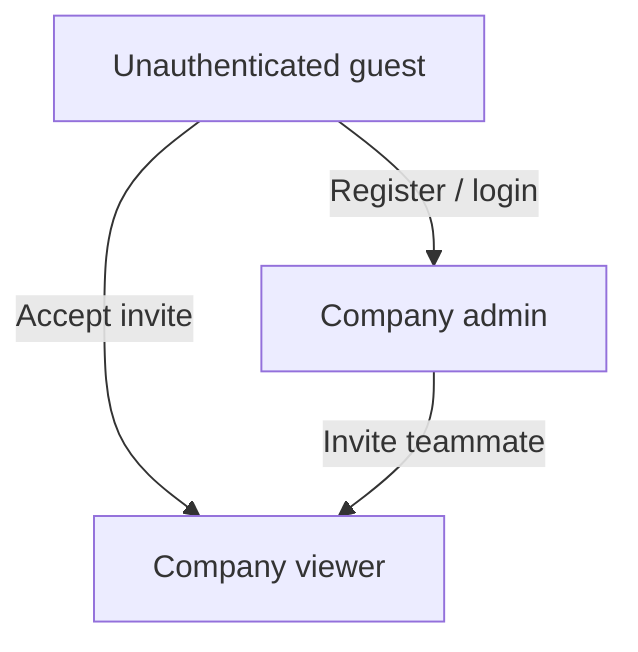

# Target Users — Habesha Payroll

**Related documents:** [04-user-personas.md](./04-user-personas.md) · [05-market-position.md](./05-market-position.md) · [18-permission-matrix.md](./18-permission-matrix.md)

---

## Ideal Customer Profile (ICP)

Derived from `habesha-payroll-mvp-plan.md`. **Needs Confirmation:** validated through customer interviews in codebase.

| Attribute | Description |
|-----------|-------------|
| Geography | Ethiopia (primary: Addis Ababa private companies) |
| Size | ~10–150 employees |
| Industry | Trading, manufacturing, NGOs, retail chains, hospitality |
| Finance maturity | Bookkeeper or small finance team; no dedicated payroll SaaS |
| Trigger | Post–tax-reform recheck, new fiscal year, audit scare, staff turnover |

---

## User segments in the application

The software implements **two in-app roles** plus unauthenticated flows:

| Segment | System role | Primary goals |
|---------|-------------|---------------|
| **Company administrator** | `admin` | Manage employees, run payroll, configure company, invite team |
| **Finance viewer** | `viewer` | Review roster, history, payslips, activity; no mutations |
| **Guest** | — | Register company, sign in, reset password, accept invite |

There is **no platform super-admin** role in the current codebase.

---

## Buyer vs. user

| Role in organization | Typical system role | Notes |
|---------------------|---------------------|-------|
| Finance manager / owner | `admin` | First registrant becomes admin (`src/routes/auth.js`) |
| Junior finance clerk | `viewer` | Invited by admin |
| External accountant | **Not modeled** | Uses CSV/PDF exports offline |

---

## Anti-personas (not targeted yet)

| Segment | Reason |
|---------|--------|
| Hourly/shift workers needing overtime | Not implemented — see Phase C in build plan |
| Multi-country employers | Out of scope |
| Enterprises needing bank-file integrations | Phase C, customer-triggered |
| Companies requiring Ethiopian calendar UI only | Gregorian periods only today |

---

## Access patterns

| Capability | Admin | Viewer | Guest |
|------------|:-----:|:------:|:-----:|
| Register company | ✅ | — | ✅ |
| View employees | ✅ | ✅ | — |
| Edit employees | ✅ | — | — |
| Run payroll | ✅ | — | — |
| View payroll history | ✅ | ✅ | — |
| Download payslips/CSV | ✅ | ✅ | — |
| Invite teammates | ✅ | — | — |
| Edit company profile | ✅ | — | — |
| Verify rate schedule | ✅ | — | — |

Full matrix: [18-permission-matrix.md](./18-permission-matrix.md).
