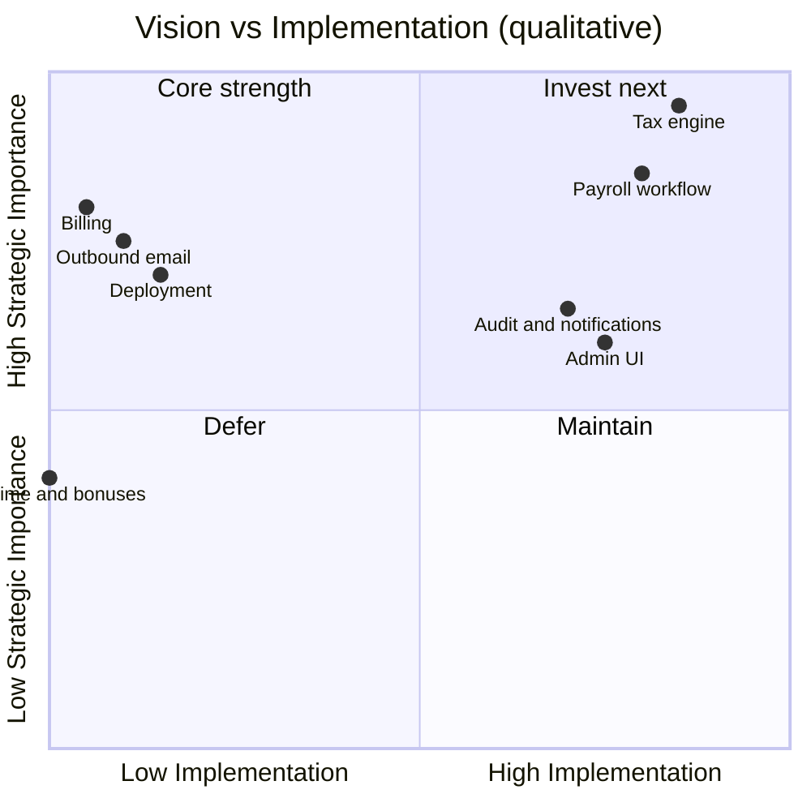

# Vision — Habesha Payroll

**Related documents:** [01-product-brief.md](./01-product-brief.md) · [08-product-roadmap.md](./08-product-roadmap.md) · [28-future-enhancements.md](./28-future-enhancements.md)

---

## Long-term vision

Become the **trusted default payroll compliance layer** for Ethiopian private employers: the system finance teams and accountants rely on because it **tracks ERCA rule changes faster than spreadsheets** and produces **defensible audit trails**.

---

## Product principles (derived from codebase and build plan)

| Principle | Evidence |
|-------------|----------|
| **Accuracy before polish** | Test-first tax engine; agent rules forbid casual bracket changes |
| **Compliance consequences are real** | Comments in `taxEngine.js` and project rules |
| **Isolate tax rules** | Single module `src/taxEngine.js` with `RATE_VERSION` |
| **Onboarding friction kills pilots** | CSV import, preview-before-run, seed script |
| **Build on customer demand (Phase C)** | Build plan defers overtime, bonuses, bank files |
| **Local trust over generic global SaaS** | Ethiopian-specific calculations and Birr context |

---

## What “done” means at MVP+ (honest scope)

From `habesha-payroll-mvp-plan.md` — **aspirational**, not implemented:

- 15–30 paying companies on founding-customer pricing
- Accountant-validated tax engine used in real monthly cycles
- Repeatable sales via accountant channel
- Product survives at least one ERCA rate change without breaking trust

---

## Vision vs. current reality

---

## Non-goals (explicit)

| Non-goal | Rationale |
|----------|-----------|
| Full HRIS / attendance | Payroll compliance focus |
| Multi-country payroll | Different product |
| Speculative Phase C features | Build when a customer asks |
| Generic “complete ERP” | Scope creep risk per build plan |

---

## Success metrics (proposed — Needs Confirmation)

| Metric | Phase | Target (from business plan) |
|--------|-------|----------------------------|
| Pilot companies onboarded | Phase 1 | 5–10 |
| Calculation errors in pilot | Phase 1 | 0 reported |
| Pilot → paid conversion | Phase 2 | ≥50% |
| Paying customers | Phase 2 | 15–30 |
| Monthly churn | Phase 2 | <5% |

No analytics or telemetry for these metrics exists in the codebase today.
