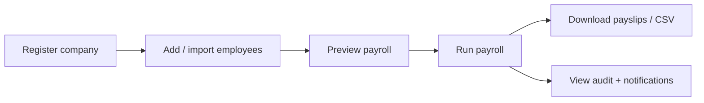

# MVP Definition — Habesha Payroll

**Related documents:** [09-feature-list.md](./09-feature-list.md) · [13-acceptance-criteria.md](./13-acceptance-criteria.md) · [27-known-limitations.md](./27-known-limitations.md)

---

## MVP scope statement

The **Minimum Viable Product** is a **multi-tenant web application** that allows an Ethiopian employer to:

1. Register a company and sign in securely  
2. Maintain an employee roster with salary and allowance data  
3. Calculate and store monthly payroll with PAYE and pension  
4. Review history, download payslips, and export CSV for filing  
5. Collaborate with a second user via admin/viewer roles  

This scope is **implemented in the current repository** (v0.1.0), extended beyond the original “Phase 0” README with Phase A features and partial Phase B.

---

## In scope — implemented ✅

| Capability | Definition of “done” in code |
|------------|------------------------------|
| **Tenant isolation** | Each company sees only its `company_id` data |
| **Auth** | Register, login, logout, session cookie, password reset (dev link) |
| **Employees** | CRUD, active/terminated status, Amharic name, transport allowance, pension exempt flag |
| **Bulk import** | CSV preview + transactional insert |
| **Tax engine** | PAYE 6 brackets, pension 7%/11% capped at ETB 15,000 basic, transport exemption |
| **Payroll** | Preview, run, one run per period, delete (admin), list, detail |
| **Outputs** | HTML payslip, PDF payslip, ZIP all PDFs, CSV export |
| **Compliance signals** | Rate version on runs, verification banner, audit log |
| **Team** | Invite flow, admin/viewer roles |
| **Profile** | User display name, password change; company name/TIN |
| **Notifications** | In-app alerts for payroll, rate verify, invites |

---

## In scope — planned but NOT in MVP code ❌

From `habesha-payroll-build-plan.md` Phase B–C and business plan:

| Capability | Phase |
|------------|-------|
| Chapa/SantimPay billing | B3 |
| Outbound email (reset, invites, alerts) | B4 |
| HTTPS production deployment | B5 |
| Postgres (optional vs. SQLite) | B2 alt |
| Overtime, bonuses, leave | C |

---

## MVP user journeys (must work end-to-end)

Detailed steps: [19-workflows.md](./19-workflows.md).

---

## Quality bar for MVP

| Requirement | Implementation |
|-------------|----------------|
| Tax engine regression tests | 26 automated tests (`npm test`) |
| Duplicate payroll period blocked | HTTP 409 from `runPayroll` |
| Admin-only mutations | `requireAdmin` in route handlers |
| Active employees only in runs | Filter `employment_status = 'active'` |

**Needs Confirmation:** independent accountant sign-off on tax engine (required by business plan, not in repo).

---

## Explicit non-MVP

| Item | Reason |
|------|--------|
| Subscription enforcement | No billing module |
| Email delivery | Dev-only link display |
| Ethiopian calendar UI | Not implemented |
| Bank payment files | Phase C |
| Mobile native app | Phase C |
| Full-text workspace search | TopBar search is UI-only |

---

## Version label

| Label | Meaning |
|-------|---------|
| **MVP 0.1.0** | Current package version in `package.json` |
| **Phase A** | Complete in code (transport, import, reset, roles, audit, rate banner) |
| **Phase B** | Partial (better-sqlite3, PDF/ZIP payslips; billing/email/deploy pending) |
