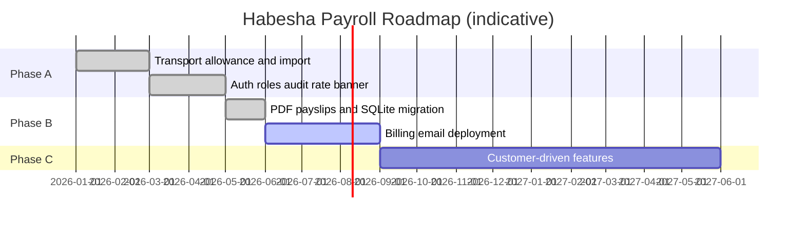

# Product Roadmap — Habesha Payroll

**Related documents:** [22-development-roadmap.md](./22-development-roadmap.md) · [28-future-enhancements.md](./28-future-enhancements.md)

Roadmap phases align with `habesha-payroll-build-plan.md`. **Status column reflects source code as of v0.1.0.**

---

## Phase summary

| Phase | Theme | Status |
|-------|-------|--------|
| **Phase 0** | Core prototype (auth, employees, flat salary payroll) | ✅ Superseded / merged into current |
| **Phase A** | Correctness + onboarding + trust | ✅ **Complete** |
| **Phase B** | Production hardening + monetization | 🟡 **Partial** |
| **Phase C** | Customer-driven extensions | ⏸ Not started |

---

## Phase A — Build now (complete ✅)

| ID | Feature | Status |
|----|---------|--------|
| A1 | Transport allowance in tax engine | ✅ |
| A2 | CSV bulk employee import | ✅ |
| A3 | Forgot-password flow (dev link) | ✅ |
| A4 | Rate-schedule verification banner | ✅ |
| A5 | Multi-user admin/viewer + invites | ✅ |
| A6 | Audit log + Activity page | ✅ |

**Additional (post build-plan, in code):**

| Feature | Status |
|---------|--------|
| React admin UI (`web/`) | ✅ |
| Company profile (name, TIN) | ✅ |
| Payroll preview | ✅ |
| User profile + password change | ✅ |
| In-app notifications | ✅ |

---

## Phase B — Real hosting / npm (partial 🟡)

| ID | Feature | Status |
|----|---------|--------|
| B1 | PDF payslip generation (PDFKit) | ✅ |
| B2 | Production DB (`better-sqlite3`) | ✅ (SQLite file; Postgres not done) |
| B2b | Payslip ZIP export | ✅ (implemented; not in original B1 spec) |
| B3 | In-app billing (Chapa/SantimPay) | ❌ |
| B4 | Outbound email | ❌ |
| B5 | HTTPS + domain + process manager | ❌ |

---

## Phase C — After 10+ paying customers (not started ⏸)

Build only when a customer requests:

| Feature | Trigger |
|---------|---------|
| Overtime (Labour Proclamation) | Hourly/shift workers |
| Bonus / commission lines | Variable pay |
| Leave deductions | Customer request |
| Other allowance types | Non-transport benefits |
| Bank bulk-payment formats | Named bank |
| Ethiopian calendar toggle | Recurring request |
| Accounting software API | Integration request |

---

## Timeline visualization

Dates are **Needs Confirmation** — illustrative only.

---

## Recommended next engineering priorities

Derived from gaps between MVP and sellable product:

1. **Documentation accuracy** — align README with current stack  
2. **Outbound email** — password reset and invites  
3. **Deployment** — staging with HTTPS  
4. **Security** — login rate limiting, production cookie flags  
5. **UI permission polish** — hide admin actions from viewers  
6. **Billing** — when pilot conversion begins  
7. **External tax review** — process + documentation  

See [22-development-roadmap.md](./22-development-roadmap.md).

---

## Business roadmap (from MVP plan — Needs Confirmation)

| Window | Goal |
|--------|------|
| Weeks 1–2 | Harden core; accuracy review |
| Weeks 3–4 | Recruit 5–10 pilots |
| Weeks 5–8 | Support real payroll cycles; billing |
| Weeks 9–12 | Convert pilots; soft launch |

Not tracked in application telemetry today.
