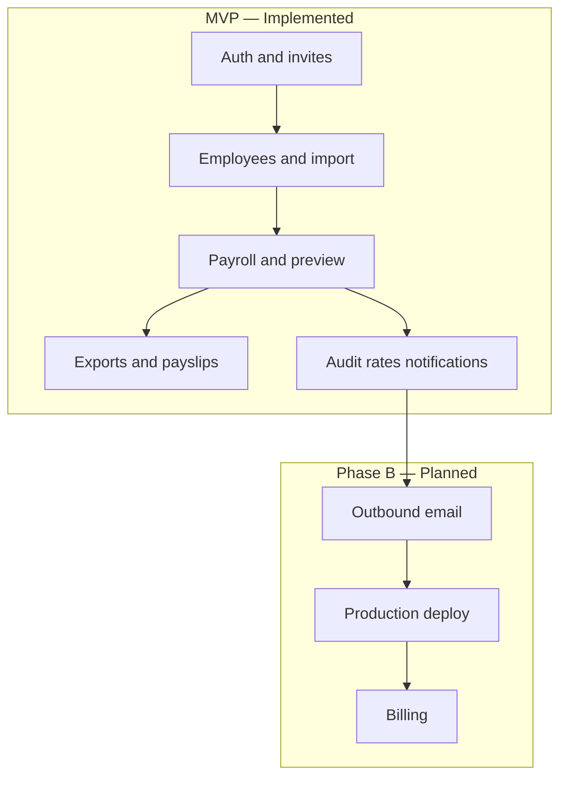

# User Stories — Habesha Payroll

**Related documents:** [10-prd.md](./10-prd.md) · [13-acceptance-criteria.md](./13-acceptance-criteria.md) · [19-workflows.md](./19-workflows.md)

Format: **As a** [role], **I want** [goal], **so that** [benefit].

Implementation status: ✅ Done · 🟡 Partial · ❌ Not done

---

## Authentication & onboarding

| ID | Story | Status |
|----|-------|--------|
| US-01 | As a **new business owner**, I want to **register my company**, so that **I can start managing payroll online**. | ✅ |
| US-02 | As a **user**, I want to **sign in securely**, so that **only my company sees our data**. | ✅ |
| US-03 | As a **user**, I want to **reset my password**, so that **I can recover access without support**. | 🟡 Link on screen, not email |
| US-04 | As an **admin**, I want to **invite a colleague**, so that **we can share access without sharing one password**. | 🟡 |
| US-05 | As an **invitee**, I want to **accept an invite and set my password**, so that **I join the correct company**. | ✅ |

---

## Employee management

| ID | Story | Status |
|----|-------|--------|
| US-10 | As an **admin**, I want to **add employees with salary and transport allowance**, so that **payroll reflects real payslip lines**. | ✅ |
| US-11 | As an **admin**, I want to **import many employees from CSV**, so that **onboarding is fast during a demo or go-live**. | ✅ |
| US-12 | As an **admin**, I want to **mark foreign nationals as pension-exempt**, so that **contributions are correct**. | ✅ |
| US-13 | As an **admin**, I want to **terminate employees**, so that **they are excluded from future payroll runs**. | ✅ |
| US-14 | As a **viewer**, I want to **view the employee roster**, so that **I can answer staff questions without edit access**. | ✅ |
| US-15 | As an **admin**, I want **Amharic name suggestions from Latin input**, so that **payslips can show Ethiopian script**. | ✅ Transliteration helper |

---

## Payroll execution

| ID | Story | Status |
|----|-------|--------|
| US-20 | As an **admin**, I want to **preview payroll before committing**, so that **I catch errors before locking a period**. | ✅ |
| US-21 | As an **admin**, I want to **run payroll for a month**, so that **tax and pension are calculated for all active staff**. | ✅ |
| US-22 | As an **admin**, I want the **system to prevent duplicate runs** for the same month, so that **I do not double-file**. | ✅ |
| US-23 | As an **admin**, I want to **delete a mistaken run**, so that **I can re-run the period**. | ✅ |
| US-24 | As a **finance user**, I want to **view payroll history**, so that **I can audit past periods**. | ✅ |

---

## Outputs & filing

| ID | Story | Status |
|----|-------|--------|
| US-30 | As a **finance user**, I want to **export CSV for a run**, so that **my accountant can file with ERCA/pension bodies**. | ✅ |
| US-31 | As a **finance user**, I want to **download PDF payslips**, so that **employees receive official documents**. | ✅ |
| US-32 | As a **finance user**, I want to **download all payslips as ZIP**, so that **I can distribute them efficiently**. | ✅ |

---

## Compliance & trust

| ID | Story | Status |
|----|-------|--------|
| US-40 | As a **finance manager**, I want to **see when PAYE rates were last verified**, so that **I trust the system uses current rules**. | ✅ |
| US-41 | As an **admin**, I want to **record a rate verification**, so that **my team sees we checked ERCA**. | ✅ |
| US-42 | As a **compliance-minded user**, I want an **activity log**, so that **I know who ran payroll and when**. | ✅ |
| US-43 | As a **user**, I want **in-app notifications** when payroll completes, so that **I stay informed without email**. | ✅ |
| US-44 | As a **user**, I want **email when payroll completes**, so that **I am notified offline**. | ❌ |

---

## Settings & profile

| ID | Story | Status |
|----|-------|--------|
| US-50 | As an **admin**, I want to **set company TIN**, so that **payslips match ERCA records**. | ✅ |
| US-51 | As a **user**, I want to **update my display name**, so that **the top bar shows my name correctly**. | ✅ |
| US-52 | As a **user**, I want to **change my password**, so that **I can rotate credentials securely**. | ✅ |

---

## Commercial (planned)

| ID | Story | Status |
|----|-------|--------|
| US-60 | As a **company admin**, I want to **pay my subscription in Birr**, so that **I can continue running payroll**. | ❌ |
| US-61 | As a **platform operator**, I want to **gate payroll on active subscription**, so that **only paying customers run payroll**. | ❌ Not during pilot per build plan |

---

## Story map (release grouping)

