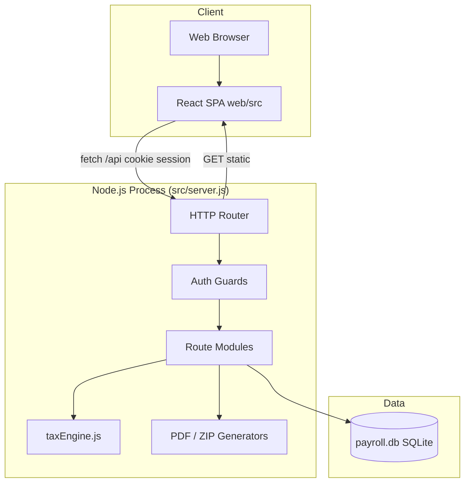
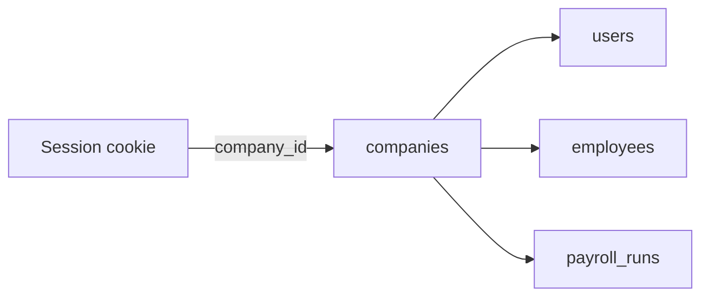
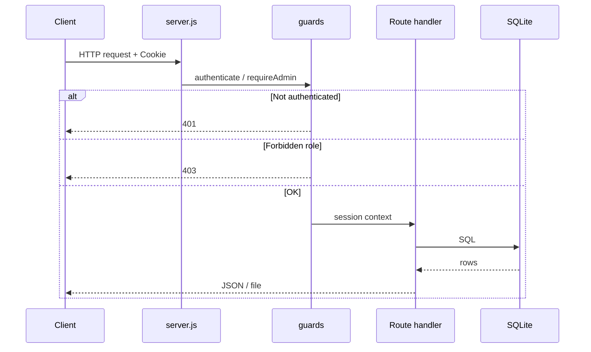

# System Architecture — Habesha Payroll

**Related documents:** [15-module-documentation.md](./15-module-documentation.md) · [21-technical-specification.md](./21-technical-specification.md) · [29-architecture-decisions.md](./29-architecture-decisions.md)

---

## Architecture style

**Monolithic single-process web application:**

- One Node.js HTTP server handles API + static SPA  
- SQLite database file on local disk  
- No microservices, message queues, or background workers  

---

## High-level diagram

---

## Deployment modes

| Mode | Command | Behavior |
|------|---------|----------|
| **Development** | `npm start` + `npm run dev:web` | API :3000; Vite :5173 proxies `/api` |
| **Production** | `npm run build:web` then `npm start` | Serves `web/dist`; SPA fallback for client routes |

See [24-deployment-guide.md](./24-deployment-guide.md).

---

## Multi-tenancy model

- Every authenticated request resolves `company_id` from session  
- Queries filter by `company_id` (except global `rate_schedule_checks`)  
- No cross-tenant queries exposed in API  

---

## Request lifecycle

---

## Frontend architecture

| Layer | Responsibility |
|-------|----------------|
| `router/` | Public vs protected routes |
| `hooks/use-auth.tsx` | Session state, `/api/auth/me` |
| `lib/api.ts` | Sole HTTP client for pages |
| `pages/` | Feature screens |
| `components/layout/` | AppShell, TopBar, PageHero |
| `index.css` | Design tokens (no component library) |

No global state library (Redux/Zustand). Pages fetch data on mount.

---

## Security architecture (as built)

| Control | Status |
|---------|--------|
| Password hashing (scrypt) | ✅ |
| HttpOnly session cookie | ✅ |
| Server-side authorization | ✅ |
| HTTPS | ❌ Not enforced in app |
| CSRF tokens | ❌ |
| Rate limiting | ❌ |
| Secure cookie flag | ❌ Not set (dev-oriented) |

---

## Scalability limits (current design)

| Constraint | Implication |
|------------|-------------|
| SQLite single writer | Suitable for MVP/pilot scale |
| Synchronous PDF/ZIP generation | Large runs block request thread |
| No horizontal scaling story | Single DB file is bottleneck |
| No CDN/static split | All assets from Node process |

**Needs Confirmation:** target concurrent company count for production sizing.

---

## External integrations

| Integration | Status |
|-------------|--------|
| Email provider | ❌ Planned |
| Chapa / SantimPay | ❌ Planned |
| ERCA API | ❌ None (manual rate updates) |
| Accounting ERP | ❌ Phase C |

---

## Key files

| File | Role |
|------|------|
| `src/server.js` | Entry point, routing table |
| `src/db.js` | Schema + migrations |
| `src/taxEngine.js` | Tax/pension domain logic |
| `web/src/main.tsx` | React bootstrap |
| `data/payroll.db` | Runtime database (created on first start) |
