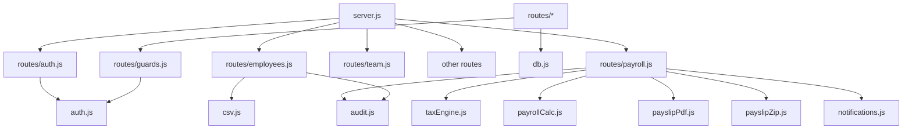

# Module Documentation — Habesha Payroll

**Related documents:** [14-system-architecture.md](./14-system-architecture.md) · [17-api-specification.md](./17-api-specification.md) · [16-database-design.md](./16-database-design.md)

---

## Backend modules (`src/`)

### Core infrastructure

| Module | File | Responsibility |
|--------|------|----------------|
| **Server** | `server.js` | HTTP server, route dispatch, static SPA serving |
| **Database** | `db.js` | SQLite connection, schema DDL, idempotent migrations |
| **HTTP utils** | `http-utils.js` | JSON body parsing, `sendJSON`, `sendError` |
| **Auth core** | `auth.js` | scrypt passwords, sessions, cookies, `authenticate()` |
| **Guards** | `routes/guards.js` | `requireSession`, `requireAdmin` |

### Domain logic

| Module | File | Responsibility |
|--------|------|----------------|
| **Tax engine** | `taxEngine.js` | PAYE, pension, transport exemption, `calculatePayroll()` |
| **Payroll calc** | `payrollCalc.js` | Period validation, batch employee calc, totals |
| **CSV** | `csv.js` | Parse CSV for import; escape for export |
| **Audit** | `audit.js` | Best-effort audit log inserts |
| **Notifications** | `notifications.js` | Best-effort in-app notification inserts |

### Document generation

| Module | File | Responsibility |
|--------|------|----------------|
| **Payslip PDF** | `payslipPdf.js` | PDFKit layout, Amharic font, compliance stamp |
| **Payslip ZIP** | `payslipZip.js` | JSZip archive of all PDFs for a run |

### Route handlers (`src/routes/`)

| Module | Endpoints | Auth pattern |
|--------|-----------|--------------|
| `auth.js` | Register, login, logout, me, reset, invite | Mixed public/protected |
| `employees.js` | CRUD + import | List: session; writes: admin |
| `payroll.js` | Preview, runs, exports, payslips | Mixed |
| `team.js` | List team, invite | List: session; invite: admin |
| `company.js` | GET/PUT company | GET: session; PUT: admin |
| `profile.js` | Profile, change password | Session |
| `rateSchedule.js` | GET verify log, POST verify | GET: session; POST: admin |
| `activity.js` | List audit log | Session |
| `notifications.js` | List, mark read | Session |

---

## Module dependency graph

---

## Frontend modules (`web/src/`)

### Routing

| Module | File | Purpose |
|--------|------|---------|
| Router | `router/index.tsx` | Route definitions |
| Protected | `router/ProtectedRoute.tsx` | Redirect if no session |
| Public | `router/PublicRoute.tsx` | Redirect if already logged in |

### Pages

| Page | Route | Primary APIs |
|------|-------|--------------|
| `LoginPage` | `/` | auth register/login |
| `DashboardPage` | `/dashboard` | employees, runs, activity, rate-schedule |
| `EmployeesPage` | `/employees` | employees, import |
| `PayrollRunPage` | `/payroll-run` | preview, runs POST |
| `PayrollHistoryPage` | `/payroll-history` | runs GET/DELETE, exports |
| `SettingsPage` | `/settings` | team, company, profile, rate verify |
| `ActivityPage` | `/activity` | activity |
| `ForgotPasswordPage` | `/forgot-password` | forgot-password |
| `ResetPasswordPage` | `/reset-password` | reset-password |
| `AcceptInvitePage` | `/accept-invite` | invite, accept-invite |

### Shared libraries

| Module | File | Purpose |
|--------|------|---------|
| API client | `lib/api.ts` | fetch wrapper with credentials |
| Formatting | `lib/format.ts` | Money, datetime, relative time |
| Transliteration | `lib/translit.ts` | Latin → Amharic name suggestion |
| Types | `types/index.ts` | TypeScript interfaces |
| Auth hook | `hooks/use-auth.tsx` | Session context provider |

### Layout components

| Component | Purpose |
|-----------|---------|
| `AppShell` | Sidebar navigation, logout |
| `TopBar` | Breadcrumbs, theme, notifications, profile link |
| `NotificationPanel` | Notification dropdown |
| `PageHero` | Page header pattern |
| `Icons` | SVG icon set |

---

## Scripts

| Script | Purpose |
|--------|---------|
| `scripts/seed.js` | Demo company, employees, payroll runs, sample notifications |

Usage: `node scripts/seed.js` or `--reset`

---

## Test modules (`test/`)

| File | Target |
|------|--------|
| `taxEngine.test.js` | Tax/pension/allowance rules |
| `payrollCalc.test.js` | Batch calc helpers |
| `csv.test.js` | CSV parser |
| `payslipPdf.test.js` | PDF output |
| `payslipZip.test.js` | ZIP output |
| `notifications.test.js` | Notification inserts (transaction rollback) |

---

## Extension points

| Extension | Recommended approach |
|-----------|------------------------|
| New tax rule | Update `taxEngine.js` + tests; bump `RATE_VERSION` |
| New API endpoint | Add handler in `routes/`, register in `server.js` |
| New page | Add to `router/index.tsx`, use `Api` only |
| New notification kind | Call `notifications.notifyCompany()` from route |
| Email delivery | New module; hook from auth/team/payroll (Phase B4) |
