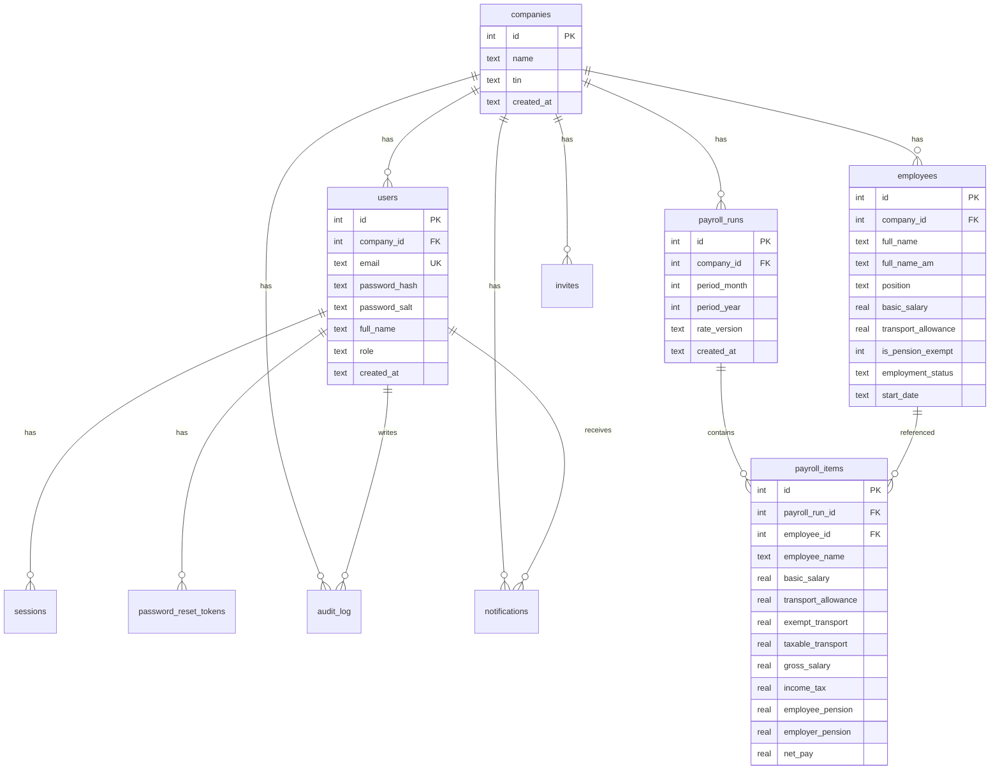

# Database Design — Habesha Payroll

**Related documents:** [12-business-rules.md](./12-business-rules.md) · [14-system-architecture.md](./14-system-architecture.md)

**Engine:** SQLite via `better-sqlite3`  
**File:** `data/payroll.db`  
**Config:** WAL journal mode, foreign keys ON (`src/db.js`)

---

## Entity relationship diagram

---

## Table reference

### `companies`
| Column | Type | Notes |
|--------|------|-------|
| id | INTEGER PK | Auto increment |
| name | TEXT NOT NULL | Display + payslips |
| tin | TEXT | Tax identification; optional |
| created_at | TEXT | Default `datetime('now')` |

### `users`
| Column | Type | Notes |
|--------|------|-------|
| id | INTEGER PK | |
| company_id | INTEGER FK → companies | ON DELETE CASCADE |
| email | TEXT UNIQUE NOT NULL | Login identifier |
| password_hash | TEXT NOT NULL | scrypt hex |
| password_salt | TEXT NOT NULL | |
| full_name | TEXT | Display name |
| role | TEXT NOT NULL | `admin` or `viewer` |
| created_at | TEXT | |

### `sessions`
| Column | Type | Notes |
|--------|------|-------|
| token | TEXT PK | Random hex |
| user_id | INTEGER FK | |
| company_id | INTEGER FK | Denormalized for fast lookup |
| expires_at | TEXT NOT NULL | ISO datetime |
| created_at | TEXT | |

### `employees`
| Column | Type | Notes |
|--------|------|-------|
| id | INTEGER PK | |
| company_id | INTEGER FK | |
| full_name | TEXT NOT NULL | |
| full_name_am | TEXT | Amharic name |
| position | TEXT | |
| basic_salary | REAL NOT NULL | |
| transport_allowance | REAL NOT NULL DEFAULT 0 | |
| is_pension_exempt | INTEGER NOT NULL DEFAULT 0 | 0/1 boolean |
| employment_status | TEXT NOT NULL DEFAULT 'active' | See note below |
| start_date | TEXT | ISO date string |
| created_at | TEXT | |

**Note:** UI uses `terminated`; seed data may use `inactive`. Payroll filter uses `'active'` only.

### `payroll_runs`
| Column | Type | Notes |
|--------|------|-------|
| id | INTEGER PK | |
| company_id | INTEGER FK | |
| period_month | INTEGER NOT NULL | 1–12 |
| period_year | INTEGER NOT NULL | |
| rate_version | TEXT NOT NULL | e.g. `2026-Proclamation-1395` |
| created_at | TEXT | |
| **UNIQUE** | (company_id, period_month, period_year) | One run per period |

### `payroll_items`
Frozen snapshot per employee per run. Includes denormalized `employee_name` and calculated columns at run time.

| Column | Type | Notes |
|--------|------|-------|
| gross_salary | REAL | basic + transport (total gross pay) |
| exempt_transport | REAL | Non-taxable allowance portion |
| taxable_transport | REAL | Taxable allowance portion |

### `password_reset_tokens`
| Column | Type | Notes |
|--------|------|-------|
| token | TEXT UNIQUE | |
| user_id | INTEGER FK | |
| expires_at | TEXT | 30-minute TTL |
| used | INTEGER DEFAULT 0 | |

### `invites`
| Column | Type | Notes |
|--------|------|-------|
| company_id | INTEGER FK | |
| email | TEXT | |
| role | TEXT | admin or viewer |
| token | TEXT UNIQUE | |
| invited_by | INTEGER FK → users | Nullable |
| expires_at | TEXT | 7-day TTL |
| used | INTEGER DEFAULT 0 | |

### `rate_schedule_checks` (global)
| Column | Type | Notes |
|--------|------|-------|
| version | TEXT | Engine version verified |
| verified_date | TEXT | Date only (YYYY-MM-DD) |
| notes | TEXT | Optional |

**Not scoped to company** — all tenants share one verification log.

### `audit_log`
| Column | Type | Notes |
|--------|------|-------|
| company_id | INTEGER FK | |
| user_id | INTEGER FK | Nullable |
| action | TEXT | e.g. `payroll.run` |
| detail | TEXT | Human-readable |
| created_at | TEXT | |

### `notifications`
| Column | Type | Notes |
|--------|------|-------|
| company_id | INTEGER FK | |
| user_id | INTEGER FK | Recipient |
| kind | TEXT | e.g. `payroll.completed` |
| title | TEXT | |
| body | TEXT | Optional |
| link_path | TEXT | SPA path e.g. `/payroll-history` |
| read_at | TEXT | NULL = unread |

---

## Migrations strategy

Inline in `db.js` on startup (idempotent):

| Migration | Trigger |
|-----------|---------|
| Rename `gross_salary` → `basic_salary` on employees | Legacy DB |
| Add `transport_allowance` | Pre-A1 |
| Add payroll_items allowance columns | Pre-A1 |
| Backfill `basic_salary` on items | Pre-A1 |
| Add `users.role` | Pre-A5 |
| Seed initial rate check | Empty table |

**Needs Confirmation:** formal migration tool (e.g. sqlite migration files) for production.

---

## Indexing

No explicit indexes beyond PRIMARY KEY and UNIQUE constraints in current schema.

**Recommendation (not implemented):** Index `audit_log(company_id, id DESC)`, `notifications(user_id, read_at)`.

---

## Backup & recovery

| Topic | Status |
|-------|--------|
| Automated backup | ❌ Not in repo |
| Point-in-time recovery | ❌ SQLite WAL files (`payroll.db-wal`) |
| Restore procedure | **Needs Confirmation** — copy `data/payroll.db` while app stopped |

See [24-deployment-guide.md](./24-deployment-guide.md).
