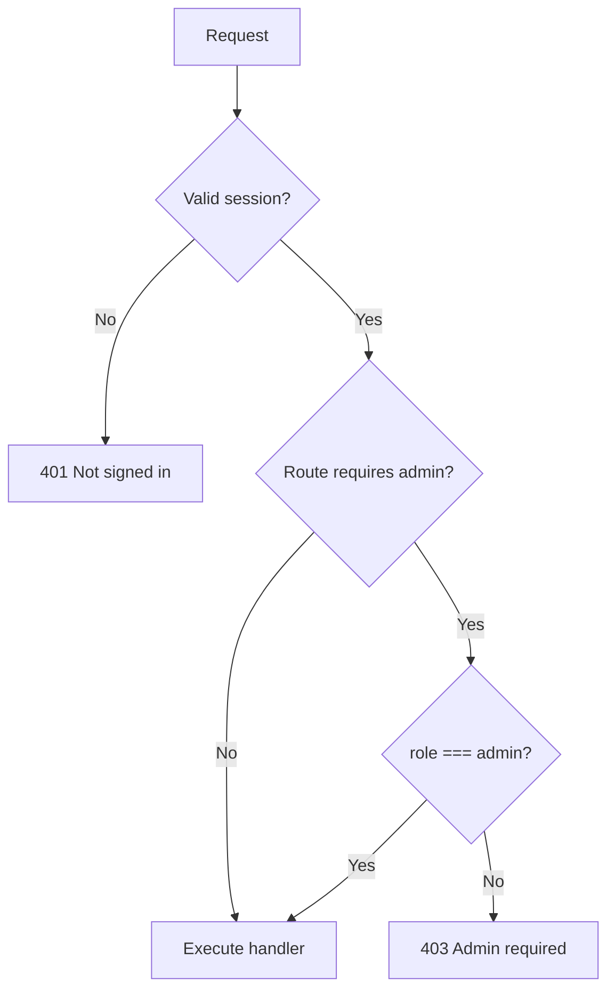

# Permission Matrix — Habesha Payroll

**Related documents:** [03-target-users.md](./03-target-users.md) · [17-api-specification.md](./17-api-specification.md) · [26-admin-manual.md](./26-admin-manual.md)

**Legend:** ✅ Allowed · ❌ Denied (403/401) · 👁 Read-only · ⚠ UI/API mismatch

Authorization is enforced **server-side** via `requireSession` and `requireAdmin` in `src/routes/guards.js`.

---

## Role definitions

| Role | Description |
|------|-------------|
| **Guest** | No session |
| **Viewer** | `users.role = 'viewer'` |
| **Admin** | `users.role = 'admin'` |

First company registrant is always admin.

---

## API permission matrix

| Endpoint | Guest | Viewer | Admin |
|----------|:-----:|:------:|:-----:|
| POST /api/auth/register | ✅ | — | — |
| POST /api/auth/login | ✅ | — | — |
| POST /api/auth/logout | ✅ | ✅ | ✅ |
| GET /api/auth/me | ❌ | ✅ | ✅ |
| POST /api/auth/forgot-password | ✅ | ✅ | ✅ |
| POST /api/auth/reset-password | ✅ | ✅ | ✅ |
| GET /api/auth/invite | ✅ | ✅ | ✅ |
| POST /api/auth/accept-invite | ✅ | — | — |
| GET /api/employees | ❌ | 👁 | 👁 |
| POST /api/employees | ❌ | ❌ | ✅ |
| PUT /api/employees/:id | ❌ | ❌ | ✅ |
| DELETE /api/employees/:id | ❌ | ❌ | ✅ |
| POST /api/employees/import | ❌ | ❌ | ✅ |
| POST /api/payroll/preview | ❌ | ❌ | ✅ |
| GET /api/payroll/runs | ❌ | 👁 | 👁 |
| POST /api/payroll/runs | ❌ | ❌ | ✅ |
| GET /api/payroll/runs/:id | ❌ | 👁 | 👁 |
| DELETE /api/payroll/runs/:id | ❌ | ❌ | ✅ |
| GET .../export.csv | ❌ | ✅ | ✅ |
| GET .../payslip/* | ❌ | ✅ | ✅ |
| GET /api/team | ❌ | 👁 | 👁 |
| POST /api/team/invite | ❌ | ❌ | ✅ |
| GET /api/rate-schedule | ❌ | 👁 | 👁 |
| POST /api/rate-schedule/verify | ❌ | ❌ | ✅ |
| GET /api/company | ❌ | 👁 | 👁 |
| PUT /api/company | ❌ | ❌ | ✅ |
| PUT /api/user/profile | ❌ | ✅ | ✅ |
| POST /api/user/change-password | ❌ | ✅ | ✅ |
| GET /api/activity | ❌ | 👁 | 👁 |
| GET /api/notifications | ❌ | 👁 | 👁 |
| POST /api/notifications/* | ❌ | ✅ | ✅ |

---

## UI permission matrix

| Screen / action | Viewer | Admin | Notes |
|-----------------|:------:|:-----:|-------|
| Sidebar: Run Payroll | Hidden | ✅ | `AppShell` adminOnly |
| Dashboard: Run Payroll CTA | Hidden | ✅ | |
| Employees: add/edit/delete/import | ❌ | ✅ | Viewer badge shown |
| Payroll Run page (direct URL) | ⚠ | ✅ | Route not role-guarded; API blocks |
| Payroll History: view/export | ✅ | ✅ | |
| Payroll History: delete button | ⚠ Visible | ✅ | API 403 for viewer |
| Settings: company edit | View-only | ✅ | |
| Settings: invite teammate | Hidden | ✅ | |
| Settings: rate verify | Hidden | ✅ | |
| Settings: profile/password | ✅ | ✅ | |
| Activity log | ✅ | ✅ | |
| Notifications | ✅ | ✅ | |

---

## Data isolation

| Rule | Enforcement |
|------|-------------|
| User sees only own company data | `session.company_id` on all queries |
| Cross-company run access | 404 |
| Global rate schedule | All tenants see same verification log |

---

## Permission decision flow

---

## Gaps & recommendations

| Gap | Risk | Recommendation |
|-----|------|----------------|
| Delete payroll visible to viewers | Low — API blocks | Hide button for viewers |
| `/payroll-run` URL accessible to viewers | Low | Add route-level role guard |
| Company/profile changes not audited | Medium | Extend audit log |
| No fine-grained permissions | Low at MVP | Sufficient for admin/viewer model |

---

## Future roles (not implemented)

**Needs Confirmation:** Additional roles (e.g. `payroll_operator`, `auditor`) are not in schema or code.
