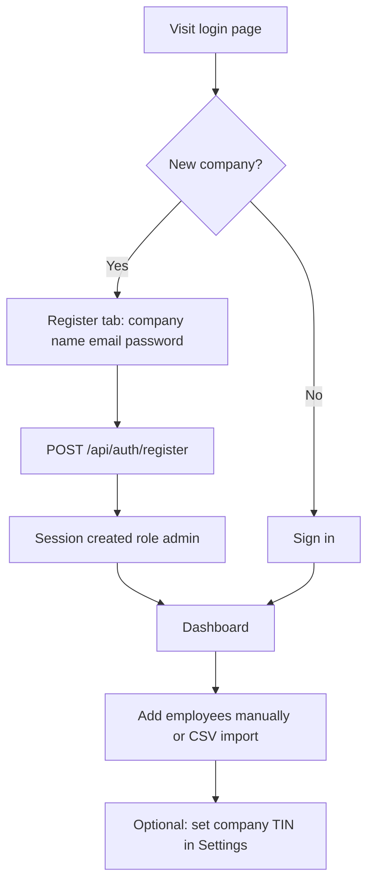
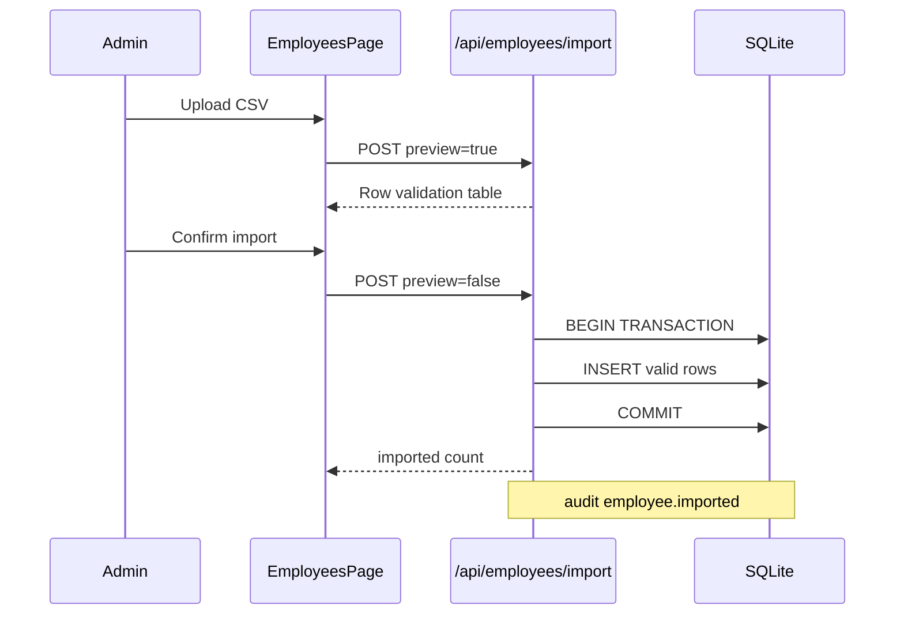
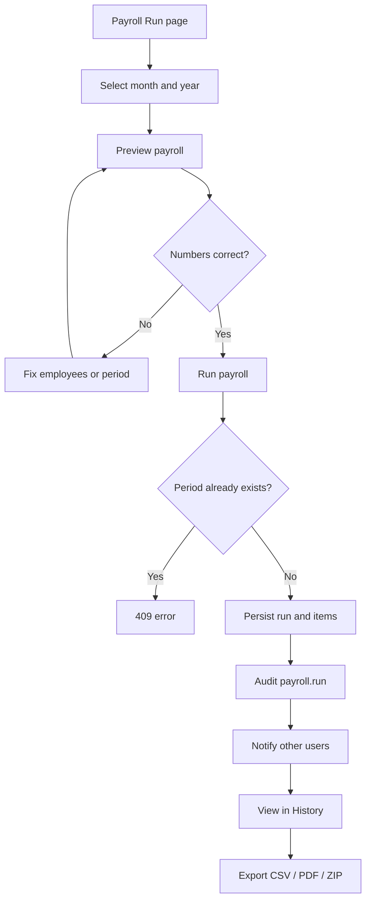
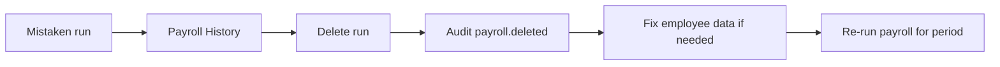
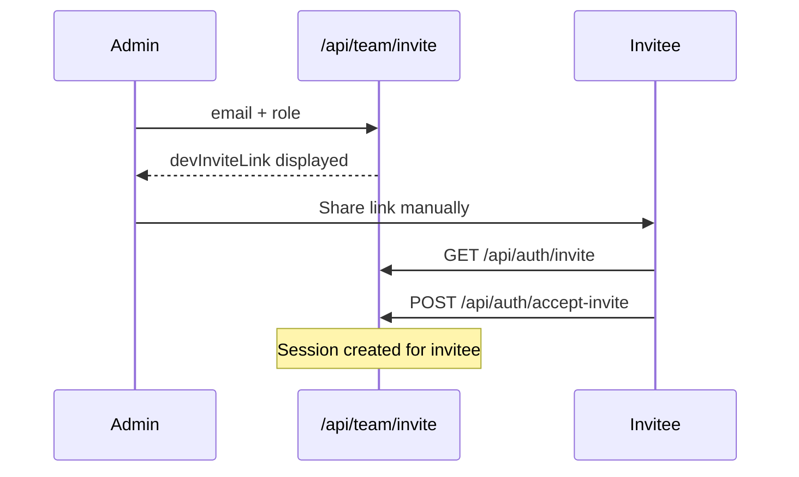
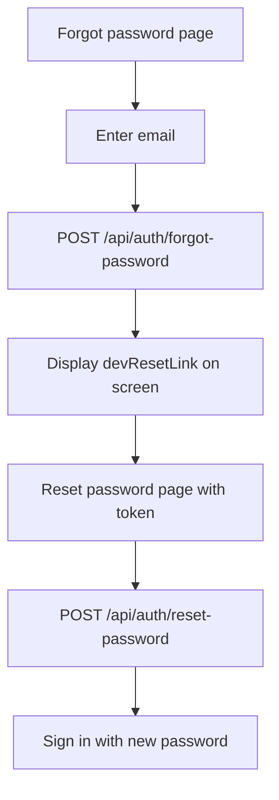
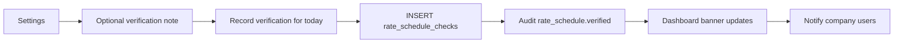
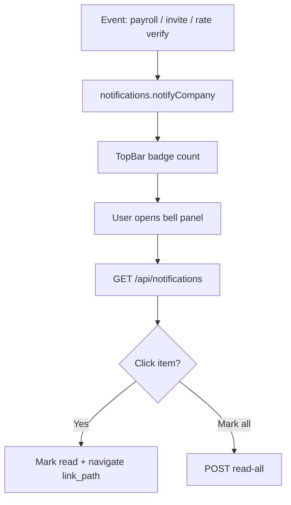
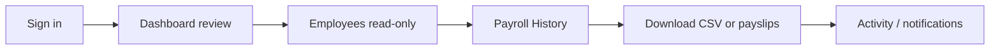

# Workflows — Habesha Payroll

**Related documents:** [11-user-stories.md](./11-user-stories.md) · [25-user-manual.md](./25-user-manual.md) · [26-admin-manual.md](./26-admin-manual.md)

---

## 1. Company onboarding

---

## 2. CSV employee import (admin)

**Required columns:** `full_name`, `basic_salary`

---

## 3. Monthly payroll run (admin)

**Business rules:** Active employees only; one run per period; rate_version stored.

---

## 4. Payroll correction (admin)

---

## 5. Teammate invitation (admin)

**Production gap:** Link should be emailed (Phase B4).

---

## 6. Password reset

---

## 7. Rate schedule verification (admin)

---

## 8. Notification consumption (all users)

Poll interval: 60 seconds (`TopBar.tsx`).

---

## 9. Payslip distribution

| Step | Action |
|------|--------|
| 1 | Open Payroll History → View run |
| 2 | Per employee: HTML preview or PDF link |
| 3 | Bulk: Download ZIP of all PDFs |
| 4 | Optional: browser Print → Save as PDF from HTML |

---

## 10. Viewer daily workflow

Viewers **cannot** run payroll or edit data (API enforced).
