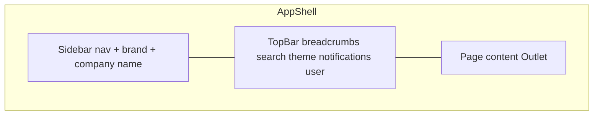

# UI Specification — Habesha Payroll

**Related documents:** [25-user-manual.md](./25-user-manual.md) · [14-system-architecture.md](./14-system-architecture.md)

---

## Design system

| Aspect | Implementation |
|--------|----------------|
| Framework | React 19 + TypeScript |
| Styling | Custom CSS in `web/src/index.css` |
| Component library | None (no shadcn/MUI) |
| Icons | Custom SVG set in `components/ui/Icons.tsx` |
| Font | Plus Jakarta Sans (loaded in `web/index.html`) |
| Theme | Light/dark via `document.documentElement.dataset.theme` |

---

## Layout structure

| Region | Behavior |
|--------|----------|
| **Sidebar** | Collapsible; state in `localStorage` (`habesha-sidebar-collapsed`) |
| **TopBar** | Workspace breadcrumb, search input, dark mode, notifications, profile link |
| **Main** | Max-width ~1320px padded content area |

---

## Route map

| Route | Page | Layout | Auth |
|-------|------|--------|------|
| `/` | Login (register/sign in) | Auth split panel | Public |
| `/forgot-password` | Forgot password | Standalone | Public |
| `/reset-password` | Reset password | Standalone | Public |
| `/accept-invite` | Accept invite | Standalone | Public |
| `/dashboard` | Dashboard | AppShell | Protected |
| `/employees` | Employees | AppShell | Protected |
| `/payroll-run` | Run payroll | AppShell | Protected (admin nav only) |
| `/payroll-history` | History | AppShell | Protected |
| `/settings` | Settings | AppShell | Protected |
| `/activity` | Activity log | AppShell | Protected |
| `*` | Redirect → `/dashboard` | — | — |

---

## Navigation (sidebar)

| Item | Path | Admin only |
|------|------|:----------:|
| Dashboard | /dashboard | |
| Employees | /employees | |
| Run Payroll | /payroll-run | ✅ |
| History | /payroll-history | |
| Activity | /activity | |
| Settings | /settings | |

---

## Page patterns

### PageHero
Used on all main pages. Variants: default, `gradient`. Props: eyebrow, title, description, actions slot.

### Cards
Primary content container (`.card`, `.card-flat`).

### Data tables
`.data-table` — employees, payroll lines, team, activity.

### Stat grid
Dashboard KPI cards (`.stat-grid`, `.stat-card`).

### Alerts
`.alert-banner` with `.error`, `.success` modifiers.

### Empty states
`.empty-state` with CTA links on dashboard and employees.

---

## Screen specifications

### Dashboard
| Element | Data source |
|---------|-------------|
| Rate banner | `/api/rate-schedule` |
| KPI cards | employees + runs (client-side aggregates) |
| Activity feed (6 items) | `/api/activity` |
| Quick actions | Role-gated links |

### Employees
| Element | Behavior |
|---------|----------|
| Table | Sort by name; avatar initials |
| Form panel | Create/edit; Amharic transliteration on Latin name |
| Import panel | CSV upload; preview table |
| Admin badge | "View-only access" for viewers |

### Payroll Run
| Element | Behavior |
|---------|----------|
| Month/year selectors | Current year ±1 |
| Preview button | Non-destructive calc |
| Run button | Commits to DB |
| Results table | Line items + totals |

### Payroll History
| Element | Behavior |
|---------|----------|
| Run list | Period, counts, totals |
| Detail view | Line items; PDF/HTML/ZIP links |
| Delete | Confirmation dialog (admin API) |

### Settings
| Section | ID | Access |
|---------|-----|--------|
| Your profile | `#profile` | All users |
| Company profile | — | Admin edit |
| Team members | — | All view; admin invite |
| Tax rate schedule | — | All view; admin verify |

### TopBar
| Element | Status |
|---------|--------|
| Search | **Placeholder only** — no functionality |
| Notifications | Dropdown panel |
| User chip | Links to `/settings#profile` |
| Dark mode | Persists to `localStorage` |

---

## Responsive behavior

| Breakpoint behavior | Source |
|---------------------|--------|
| TopBar wraps; search full width | `index.css` ~1182px |
| User text hidden on small screens | Sidebar collapse supported |

**Needs Confirmation:** formal mobile UX requirements.

---

## Accessibility notes

| Item | Status |
|------|--------|
| Icon buttons have `aria-label` | Partial (TopBar) |
| Form labels | Present on main forms |
| Full WCAG audit | ❌ Not documented |

---

## Brand elements

| Element | Detail |
|---------|--------|
| Seal mark | `ሀ` in sidebar and auth panel |
| Product name | Habesha Payroll / Admin Suite |
| Payslip stamp | Proclamation 1395/2026 compliant (PDF/HTML) |

---

## UI ↔ API rule

**All page API calls must go through `web/src/lib/api.ts`** (project agent rule). Auth state via `useAuth` hook only.
