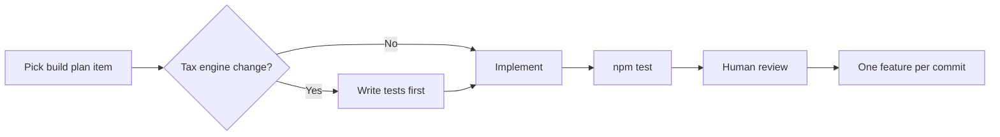

# Development Roadmap — Habesha Payroll

**Related documents:** [08-product-roadmap.md](./08-product-roadmap.md) · [23-testing-strategy.md](./23-testing-strategy.md) · [28-future-enhancements.md](./28-future-enhancements.md)

Engineering-focused sequencing. Status as of v0.1.0.

---

## Completed milestones ✅

| Milestone | Deliverables |
|-----------|--------------|
| **Core MVP** | Auth, employees, payroll, HTML payslips, CSV, dashboard |
| **Phase A** | Transport allowance, CSV import, password reset, roles, audit, rate banner |
| **Frontend migration** | React/Vite admin UI replacing legacy vanilla JS |
| **Phase B (partial)** | better-sqlite3, PDF payslips, ZIP export, preview, company TIN, profile, notifications |
| **Test suite** | 26 unit tests |

---

## Current sprint priorities (recommended)

| Priority | Task | Effort | Dependency |
|:--------:|------|--------|------------|
| P0 | Update README to match current stack | S | None |
| P0 | Document accountant sign-off process | S | External |
| P1 | Outbound email (reset, invites) | M | Email provider choice |
| P1 | Staging deployment + HTTPS | M | Hosting choice |
| P1 | Login rate limiting | S | Deployment |
| P2 | UI: hide admin actions from viewers | S | None |
| P2 | Normalize employment_status values | S | None |
| P2 | HTTP integration tests | M | None |
| P3 | Billing (Chapa/SantimPay) | L | Business decision |
| P3 | Health check endpoint | S | Deployment |

S/M/L = small/medium/large — **Needs Confirmation** for calendar estimates.

---

## Phase B completion checklist

| Item | Status | Owner |
|------|--------|-------|
| B1 PDF payslips | ✅ | Eng |
| B2 better-sqlite3 | ✅ | Eng |
| B2 Postgres option | ❌ | Eng |
| B3 Billing | ❌ | Eng + Business |
| B4 Email | ❌ | Eng |
| B5 Deploy + TLS | ❌ | Ops |

---

## Technical debt backlog

| ID | Item | Priority |
|----|------|----------|
| TD-01 | Stale README / build plan status | P0 |
| TD-02 | No API integration tests | P1 |
| TD-03 | Hand-rolled router growth | P2 |
| TD-04 | Global rate_schedule_checks | P2 |
| TD-05 | Inline payslip HTML in payroll.js | P3 |
| TD-06 | No DB indexes on audit/notifications | P3 |
| TD-07 | TopBar search placeholder | P3 |
| TD-08 | Git tracking of SQLite WAL files | P2 |

---

## Engineering workflow (from project rules)

| Rule | Detail |
|------|--------|
| Tax changes | Test-first in `test/taxEngine.test.js` |
| Bracket constants | Do not modify without explicit approval |
| Commits | One feature per commit; ask before git commit |
| Frontend API | Only via `web/src/lib/api.ts` |

---

## Release criteria

### Internal demo release (current)
- [x] End-to-end payroll workflow  
- [x] Automated tax tests pass  
- [x] React UI builds  

### Pilot release (next)
- [ ] Email for reset/invites  
- [ ] HTTPS staging URL  
- [ ] Accurate README + docs  
- [ ] **Needs Confirmation:** accountant sign-off recorded  
- [ ] Seed script documented for demos  

### Paid launch release
- [ ] Billing integrated  
- [ ] Production monitoring  
- [ ] Backup strategy  
- [ ] Security hardening complete  

---

## Dependency decisions (Needs Confirmation)

| Decision | Options | Blocks |
|----------|---------|--------|
| Hosting | Render, Railway, Fly.io, VPS | B5 |
| Email | Resend, SendGrid, SES, etc. | B4 |
| Payments | Chapa, SantimPay | B3 |
| Database long-term | SQLite vs Postgres | Scale |

---

## Suggested 90-day engineering timeline

| Weeks | Focus |
|-------|-------|
| 1–2 | Docs accuracy, email, employment status fix, viewer UI |
| 3–4 | Staging deploy, rate limiting, health check, integration tests |
| 5–8 | Pilot support fixes, billing spike, backup automation |
| 9–12 | Production hardening, Postgres evaluation if needed |

Aligns with business plan — dates **Needs Confirmation**.
