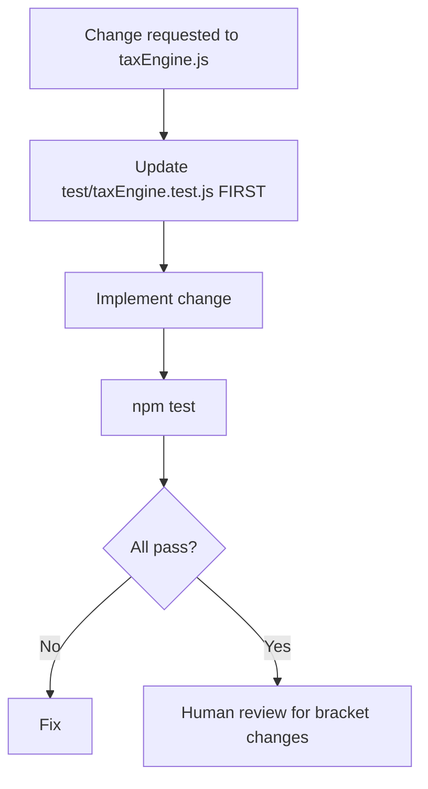

# Testing Strategy — Habesha Payroll

**Related documents:** [13-acceptance-criteria.md](./13-acceptance-criteria.md) · [12-business-rules.md](./12-business-rules.md)

---

## Testing philosophy

For a **compliance product**, tax calculation correctness is the highest-risk surface. Testing prioritizes:

1. **Tax engine accuracy** (automated, exhaustive)  
2. **Payroll calculation helpers** (automated)  
3. **Document generation smoke tests** (automated)  
4. **API contracts & tenant isolation** (gap — manual / future)  
5. **UI/E2E** (gap — manual)  

---

## Test runner

| Aspect | Value |
|--------|-------|
| Framework | Node.js built-in `node:test` |
| Command | `npm test` |
| Count | 26 tests (6 files) |
| CI | **Needs Confirmation** — no pipeline in repo |

---

## Test inventory

| File | Scope | Tests |
|------|-------|:-----:|
| `test/taxEngine.test.js` | PAYE, pension, transport allowance, worked examples | 11 |
| `test/payrollCalc.test.js` | Period validation, batch calc, totals | 3 |
| `test/csv.test.js` | CSV parser edge cases | 5 |
| `test/payslipPdf.test.js` | PDF buffer validity, filename, allowance rows | 3 |
| `test/payslipZip.test.js` | ZIP structure, filename | 2 |
| `test/notifications.test.js` | notifyCompany, notifyUser (rollback) | 2 |

---

## Tax engine test policy (mandatory)

From project agent rules:

**Never modify PAYE bracket table or pension rates without explicit legal change approval.**

### Required scenarios (implemented)
- Zero/negative income  
- Tax-free threshold (≤ ETB 2,000)  
- Bracket boundary cumulative amounts  
- ETB 15,000 published example  
- Legacy `grossSalary` alias  
- Pension cap at ETB 15,000  
- Pension exemption flag  
- High earner top bracket  
- Transport: under caps, ETB 2,200 cap, 25% basic cap  

### A1 review checkpoint (mandatory before transport allowance commits)
Three worked examples must be human-verified — documented in build plan and tested in code.

---

## Coverage gaps

| Area | Risk | Recommended test type |
|------|------|----------------------|
| HTTP API routes | High | Integration tests with supertest or raw HTTP |
| Auth session expiry | Medium | Integration |
| Tenant isolation (cross-company) | Critical | Integration |
| Admin vs viewer 403 | Medium | Integration |
| CSV import end-to-end | Medium | Integration |
| Payroll duplicate 409 | Low | Integration |
| React components | Low | Component tests (optional for MVP) |
| E2E user journeys | Medium | Playwright/Cypress before pilot |

---

## Manual test checklist (pilot)

| # | Scenario | Role |
|---|----------|------|
| 1 | Register new company | Guest |
| 2 | Import 10+ employees via CSV | Admin |
| 3 | Preview payroll | Admin |
| 4 | Run payroll | Admin |
| 5 | Download CSV, PDF, ZIP | Admin |
| 6 | Viewer cannot run payroll (API) | Viewer |
| 7 | Invite viewer; accept invite | Admin + Guest |
| 8 | Reset password flow | Any |
| 9 | Delete and re-run payroll | Admin |
| 10 | Verify rate schedule | Admin |
| 11 | Cross-check totals vs spreadsheet | Admin + Accountant |

---

## Test data

| Resource | Purpose |
|----------|---------|
| `scripts/seed.js` | Demo company with 8 employees, 3 payroll runs |
| Demo login | `demo@habesha.test` / `demo1234` (from seed script) |

Run: `node scripts/seed.js` or `node scripts/seed.js --reset`

---

## Regression strategy

| Trigger | Action |
|---------|--------|
| Any PR | Run `npm test` |
| Tax law update | Add worked example test before merging |
| Dependency upgrade | Run full test suite + manual payslip visual check |
| Before pilot payroll | Accountant cross-check first 2–3 runs |

---

## Performance testing

**Not implemented.**

**Needs Confirmation:** acceptable payroll run size (employees) and ZIP generation time limits.

---

## Security testing

| Test | Status |
|------|--------|
| SQL injection | Mitigated by design; no automated probe |
| Auth bypass | Manual |
| Path traversal on static | Code review only |
| Penetration test | **Needs Confirmation** before production |

See [27-known-limitations.md](./27-known-limitations.md).

---

## Definition of test done

- [ ] All 26 automated tests pass  
- [ ] New tax logic has corresponding unit tests  
- [ ] Manual pilot checklist executed for release candidate  
- [ ] **Needs Confirmation:** external accountant validates sample runs  
