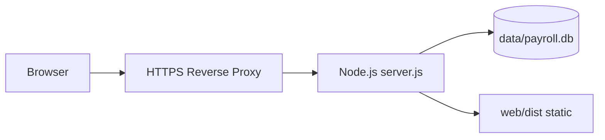

# Deployment Guide — Habesha Payroll

**Related documents:** [21-technical-specification.md](./21-technical-specification.md) · [27-known-limitations.md](./27-known-limitations.md)

**Status:** Deployment is **not configured in the repository**. This guide describes supported build/run procedures and production recommendations from planning documents.

---

## Local development

### Prerequisites
- Node.js ≥ 22.5.0  
- npm  

### Install dependencies
```bash
npm install          # root: better-sqlite3, pdfkit, jszip
npm install --prefix web
```

### Run (two terminals)
```bash
# Terminal 1 — API
npm start            # http://localhost:3000

# Terminal 2 — Frontend dev server
npm run dev:web      # http://localhost:5173 (proxies /api)
```

### Demo data
```bash
node scripts/seed.js
# or
node scripts/seed.js --reset
```

---

## Production build

```bash
npm install
npm run build:web    # installs web deps + vite build → web/dist
npm start            # serves API + web/dist on PORT (default 3000)
```

The server serves static assets from `web/dist` and falls back to `index.html` for client routes.

---

## Architecture (production)



**Needs Confirmation:** specific hosting provider.

---

## Environment configuration

| Variable | Required | Default | Description |
|----------|:--------:|---------|-------------|
| `PORT` | No | 3000 | HTTP listen port |

**Not in repo (recommended for production):**
- `NODE_ENV=production`
- Email API keys (Phase B4)
- Payment webhook secrets (Phase B3)

---

## Database persistence

| Topic | Guidance |
|-------|----------|
| Location | `data/payroll.db` relative to project root |
| WAL files | `payroll.db-wal`, `payroll.db-shm` — backup together |
| First start | Schema created automatically |

### Backup procedure (recommended)
1. Stop Node process  
2. Copy `data/payroll.db` (+ WAL/SHM if present) to secure storage  
3. Restart process  

**Needs Confirmation:** automated backup schedule and off-site storage.

---

## HTTPS & reverse proxy

From README and build plan — **not implemented in code**:

| Option | Notes |
|--------|-------|
| Render / Railway / Fly.io | Platform-managed TLS |
| VPS + Caddy/Nginx | Manual cert (Let's Encrypt) |

Cookie `Secure` flag should be enabled when serving over HTTPS (**Needs Confirmation:** code change required).

---

## Process management

| Tool | Command example |
|------|-----------------|
| pm2 | `pm2 start src/server.js --name habesha-payroll` |
| systemd | **Needs Confirmation** — unit file not in repo |
| Platform | Provider-native process supervisor |

Do not run bare `node src/server.js` in production without restart policy.

---

## Pre-deployment checklist

| Item | Status |
|------|--------|
| `npm test` passes | Required |
| `npm run build:web` succeeds | Required |
| HTTPS enabled | Required for production |
| Persistent volume for `data/` | Required |
| Email provider configured | Required for reset/invites |
| Login rate limiting | Recommended |
| Health check / uptime monitoring | Recommended |
| Accountant sign-off documented | Required for compliance |
| README accurate | Recommended |

---

## Scaling considerations

| Constraint | Mitigation |
|------------|------------|
| SQLite single writer | Migrate to Postgres if concurrent load grows |
| In-request PDF/ZIP generation | Consider async job queue at scale |
| Single Node instance | Vertical scale first; horizontal needs shared DB |

---

## Rollback procedure

**Needs Confirmation** — suggested approach:

1. Stop application  
2. Restore previous `payroll.db` backup  
3. Deploy previous application build artifact  
4. Restart and verify `/api/auth/me`  

No blue/green or migration rollback tooling exists today.

---

## Monitoring

| Signal | Implementation |
|--------|----------------|
| Process alive | Platform health check |
| Error rate | **Needs Confirmation** — add logging/APM |
| Disk space (DB) | Host monitoring |
| Tax engine version | Dashboard rate banner |

Recommended: add `GET /api/health` returning `{ "ok": true }`.

---

## CI/CD

**Not configured in repository.**

Suggested pipeline:
1. Install deps  
2. `npm test`  
3. `npm run build:web`  
4. Deploy artifact + persist `data/` volume  

**Needs Confirmation:** GitHub Actions or platform-native CI.
