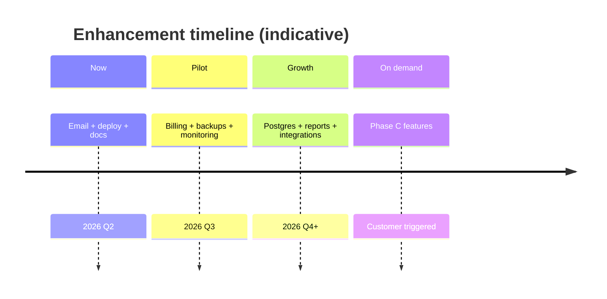

# Future Enhancements — Habesha Payroll

**Related documents:** [08-product-roadmap.md](./08-product-roadmap.md) · [27-known-limitations.md](./27-known-limitations.md) · [22-development-roadmap.md](./22-development-roadmap.md)

Enhancements are grouped by **build plan phase**. Phase C items are **customer-triggered** — do not build speculatively per project philosophy.

---

## Phase B — Production & monetization (planned)

| ID | Enhancement | Priority | Dependency |
|----|-------------|----------|------------|
| FE-B01 | Outbound email (reset, invites, payroll alerts) | P0 | Email provider |
| FE-B02 | HTTPS deployment + process manager | P0 | Hosting |
| FE-B03 | Chapa or SantimPay billing | P1 | Business decision |
| FE-B04 | `subscriptions` table + tier gating | P1 | FE-B03 |
| FE-B05 | Postgres migration (optional) | P2 | Scale requirement |
| FE-B06 | Login rate limiting | P1 | Deployment |
| FE-B07 | Health check endpoint | P2 | Monitoring |
| FE-B08 | Automated DB backups | P1 | Ops |

---

## Phase C — Customer-driven (defer)

| Enhancement | Build when… |
|-------------|-------------|
| Overtime calculation (1.5x–2.5x) | Customer has hourly/shift workers |
| Bonus / commission line items | Variable pay required |
| Leave deduction handling | Customer requests |
| Housing / other allowance types | Non-transport benefits needed |
| Bank bulk-payment export formats | Customer names their bank |
| Ethiopian calendar display toggle | Recurring customer request |
| Accounting software API | Integration request |
| Mobile app | Data shows mobile-web demand |
| Multi-country payroll | Unlikely — separate product |

---

## Near-term product enhancements (recommended)

Not in build plan but supported by codebase gaps:

| Enhancement | Rationale |
|-------------|-----------|
| Hide admin UI actions from viewers | Permission matrix gap |
| Route guard on `/payroll-run` | Defense in depth |
| Audit company/profile changes | Compliance completeness |
| Normalize `employment_status` enum | Data consistency |
| Functional workspace search | TopBar placeholder |
| Email address change flow | User lifecycle |
| Per-company rate verification | Multi-tenant SaaS expectation |
| Historical payroll recalc tool | Rule change scenarios |
| `GET /api/health` | Deployment monitoring |
| OpenAPI spec generation | API documentation drift |

---

## Tax engine evolution

| Enhancement | Notes |
|-------------|-------|
| Versioned bracket history in DB | Support recalc of old periods |
| Automated ERCA change monitoring | Manual process today |
| "What changed" in-app changelog | Retention moat from business plan |
| Stale rate alert (> N months) | README suggestion |

All tax changes require test-first workflow — see [23-testing-strategy.md](./23-testing-strategy.md).

---

## Reporting enhancements

| Report | Status | Value |
|--------|--------|-------|
| CSV per run | ✅ Implemented | Filing handoff |
| PAYE remittance summary | ❌ | ERCA workflow |
| Pension remittance summary | ❌ | Fund workflow |
| Employer cost report | ❌ | Finance planning |
| YTD employee tax summary | ❌ | Year-end |

---

## UX enhancements

| Enhancement | Effort |
|-------------|--------|
| Onboarding wizard (first payroll) | Medium |
| Employee self-service portal | Large |
| Payslip email delivery to employees | Medium (requires B4) |
| Bulk employee export | Small |
| Dashboard date-range filters | Small |
| Keyboard shortcuts | Small |

---

## Infrastructure enhancements

Dates **Needs Confirmation**.

---

## Explicit non-enhancements

| Item | Reason |
|------|--------|
| Full HRIS | Out of product scope |
| ERPNext/Frappe integration | Not in codebase direction |
| Crypto payment | Not in business plan |
| AI tax advice | Compliance risk |

---

## How to propose enhancements

**Needs Confirmation:** internal process for prioritization.

Suggested criteria (from build plan):
1. Would it produce a **wrong payslip number**? → Highest priority  
2. Does it **block onboarding** without hand-holding? → High  
3. Does it **block getting paid**? → High before commercial launch  
4. Otherwise → defer until customer evidence  
